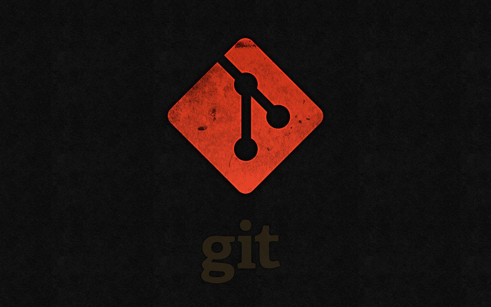

# Git

## 简介

Git 是一个分布式版本控制系统，用于跟踪计算机文件的修改，尤其是源代码文件。
它允许多个开发者协同工作，管理项目的版本历史。
Git 的设计目标是速度、数据完整性和支持分布式、非线性工作流程。
本文档主要是帮助用户在 Centos7.6 Linux 下安装 Git。

## 安装方式

- yum
- 源码安装

## yum 

```bash
sudo yum install -y git
```

## 源码安装
</img>

Note: 此部分内容待完善。由于服务器资源限制，源码安装相关内容将在后期补充。